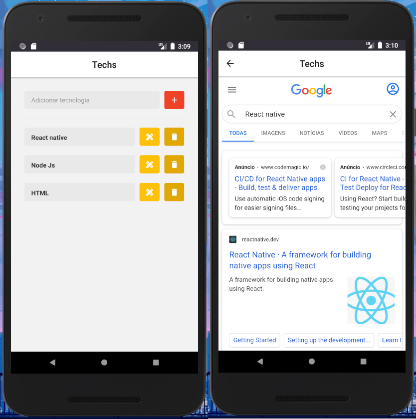

# Projeto: Search Tech

Criar um app que faz pesquisa no google

### Utilidade:

- Aprender a usar React Native.

#### Material:

- React Native
- Axios
- Json Server
- React Native WebView
- Styled Components
- React Native Vector Icons
- React Navigation

#### Pré-requisitos

Antes de usar a aplicação, é ideal que você tenha o ambiente [Android](https://reactnative.dev/docs/environment-setup) configurado.

#### Modo de uso:

1. Abra um terminal ( cmd/propt de comando )
2. Clone o repositório ( git clone git@github.com:RobMota/searchTech-app-react-native.git ) em algum local de preferência
3. Acesse a pasta ( cd searchTech-app-react-native )
4. E digite o comando abaixo:

- `npx react-native start`

5. Abra um novo terminal ( cmd/propt de comando ) dentro da pasta ( searchTech-app-react-native ) e digite o comando abaixo:

- `npx react-native run-android`

6. Abra um novo terminal ( cmd/propt de comando ) dentro da pasta ( searchTech-app-react-native ) e digite o comando abaixo:

- `npx json-server server.json -p 4001`

#### Autor do projeto original:

- [Roberto Alves](https://github.com/robertosousa1)
